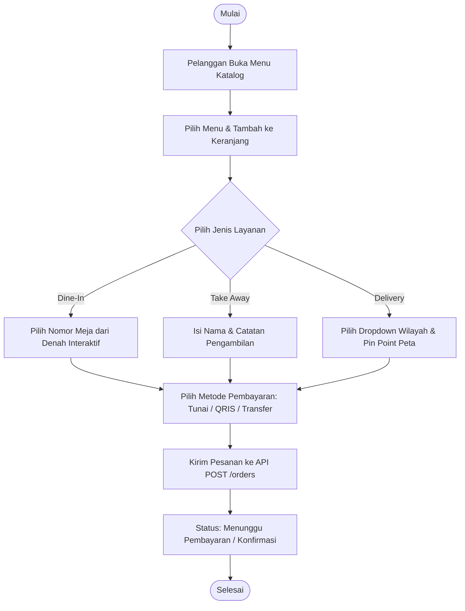
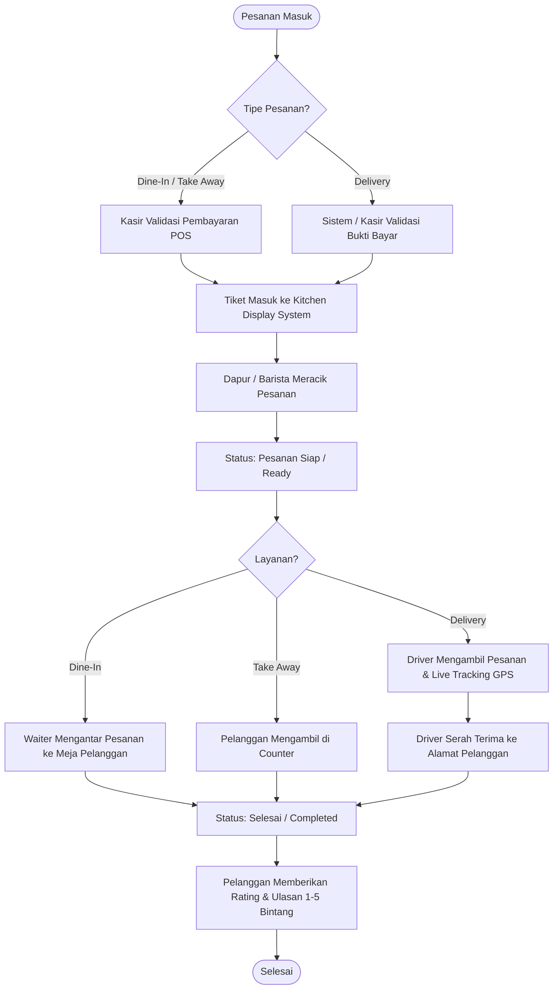
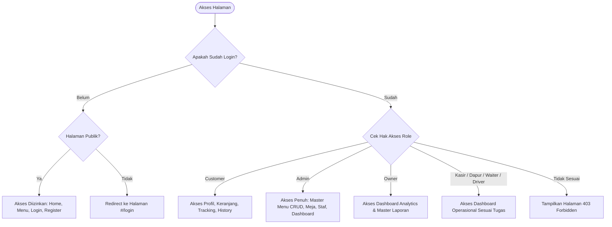

# ☕ Ruang Rasa Coffee - Web Application (Projekan S1)

> **Aplikasi Web Fullstack Terpadu Manajemen Café & Coffee Shop (POS Kasir, Kitchen Barista, Waiter, Driver Delivery Tracking, dan Self-Service Customer).**

---

## 📖 Deskripsi Singkat Aplikasi

**Ruang Rasa Coffee** adalah aplikasi web modern yang dirancang untuk mengotomatisasi dan mengintegrasikan seluruh lini operasional café mulai dari pemesanan mandiri oleh pelanggan (*Dine-In dengan pemilihan meja interaktif, Take Away, dan Delivery kurir berbasis peta*), pemrosesan pesanan di dapur & barista, pencatatan transaksi POS kasir, pengantaran makanan oleh waiter ke meja, hingga live tracking GPS pengantaran kurir/driver.

Aplikasi ini dikembangkan dengan arsitektur **MVCS (Model-View-Controller-Service)** murni pada sisi backend dan **Single Page Application (SPA)** berbasis Native ES6+ & Custom Design System pada sisi frontend untuk performa cepat, responsif, dan elegan.

---

## ✨ Fitur Utama Sistem

1. **Multi-Role Role-Based Access Control (RBAC)**:
   - Mendukung **7 peran pengguna**: *Super Admin, Owner / Manajemen, Petugas Kasir, Barista / Dapur, Pramusaji / Waiter, Kurir / Driver, dan Pelanggan (Customer)*.
2. **Alur Autentikasi Lengkap**:
   - Register akun pelanggan & staf baru, Login dengan token JWT Bearer, Refresh Token, Forgot Password, dan Reset Password.
3. **Pemesanan Multi-Channel (3 Mode Layanan)**:
   - **Dine-In (Makan di Tempat)**: Pemilihan nomor meja denah interaktif, perhitungan PPN otomatis, struk digital, dan pengantaran pramusaji.
   - **Take Away (Bawa Pulang)**: Penyiapan pesanan cepat di counter café.
   - **Delivery (Pesan Antar)**: Dropdown alamat bertingkat (Kota $\rightarrow$ Kecamatan $\rightarrow$ Kelurahan $\rightarrow$ RT/RW) terintegrasi **Peta Leaflet Pin Point (Two-Way Sync)** dan Live GPS Tracking driver.
4. **Kitchen Display System (KDS)**:
   - Pemantauan tiket pesanan masuk secara *real-time* untuk tim barista dan dapur dengan filter status racikan (*Cooking $\rightarrow$ Ready*).
5. **Point of Sale (POS) & Verifikasi Kasir**:
   - Konfirmasi pembayaran tunai, QRIS, dan transfer bank serta pencetakan struk transaksi.
6. **Live Driver Tracking (Peta Interaktif)**:
   - Pelacakan posisi kurir pengantar pesanan delivery secara visual di peta.
7. **Executive Dashboard & Realtime Analytics**:
   - Visualisasi KPI omset harian, tren pesanan, total menu terjual, dan pemantauan okupansi meja.
8. **Master Data CRUD Lengkap**:
   - Manajemen Master Menu, Kategori, Meja Makan, dan Voucher Promo dengan fitur pencarian, filter bertingkat, multi-sorting (A-Z, terbaru), pagination dinamis, dan **upload berkas foto/PDF**.
9. **Ulasan & Rating**:
   - Pelanggan dapat memberikan rating bintang 1–5 dan ulasan testimoni setelah pesanan selesai.

---

## 🛠️ Teknologi yang Digunakan

### **Backend (Server-Side)**
- **Framework**: ASP.NET Web API 2 (.NET Framework 4.7.2)
- **Arsitektur**: MVCS Pattern (*Model, View, Controller, Service Layer Interface & Implementation*)
- **ORM & Database**: Entity Framework 6 (Code-First / Database-First) & Microsoft SQL Server (MSSQL)
- **Keamanan**: JWT Authentication (`System.IdentityModel.Tokens.Jwt`), BCrypt Password Hashing (`BCrypt.Net-Next`)
- **API Standard**: RESTful API (*GET, POST, PUT, PATCH, DELETE*) dengan response konsisten `ApiResponse<T>`

### **Frontend (Client-Side)**
- **Struktur & Logika**: Semantic HTML5, JavaScript Modern (ES6+ Modules & Fetch API)
- **Arsitektur Client**: Single Page Application (SPA) Hash-based Routing dengan Route Guards
- **Styling**: Custom Vanilla CSS Design System (Warm Coffeehouse Dark & Light Palette, Glassmorphism, Micro-animations)
- **Peta Interaktif**: Leaflet.js & OpenStreetMap Tiles
- **Iconography & Typography**: Google Material Symbols Rounded & Outfit / Playfair Display Fonts

---

## 📁 Struktur Folder Proyek (Monorepo)

```text
ruangrasa/
├── RuangrasaDb.sql                     # Script database lengkap (DDL, DML, Relasi, Soft Delete & Seed Data >= 20)
├── RuangRasa_API.postman_collection.json # Dokumentasi pengujian REST API Postman
├── README.md                           # Dokumentasi resmi proyek
├── ruangrasa.slnx                      # Solution Visual Studio
└── ruangrasa/                          # Direktori Aplikasi Utama
    ├── App_Start/                      # Konfigurasi WebApiConfig, RouteConfig, FilterConfig
    ├── Controllers/                    # Web API Controllers (RuangrasaApiController, UploadController, dll.)
    ├── Models/                         # Data Model
    │   ├── Entity/                     # Entity Classes (User, Role, Menu, DiningTable, Order, OrderItem, dll.)
    │   └── ViewModel/                  # DTO, Request & Response Models (ApiResponse, PagingResponse, dll.)
    ├── Services/                       # Business Logic Layer
    │   ├── Context/                    # EF DbContext (RuangrasaDbContext)
    │   ├── Interface/                  # Service Contract (IRuangrasaService)
    │   └── Impl/                       # Service Implementation (RuangrasaService)
    ├── Uploads/                        # Direktori penyimpanan berkas gambar & PDF
    ├── Web.config                      # Konfigurasi aplikasi & database connection string
    └── client/                         # Frontend Single Page Application (SPA)
        ├── index.html                  # Main SPA Entry Point
        ├── css/
        │   └── style.css               # Design System & UI Styling
        └── js/
            ├── app.js                  # Global State, Validator & Helper
            ├── api.js                  # API Client Wrapper (JWT, Error Handler, Upload, Patch)
            ├── router.js               # Client-Side Hash Router & RBAC Guard
            ├── toast.js                # Komponen Toast Notification
            ├── components/             # Reusable UI Components (Navbar, TablePicker, CartModal)
            └── pages/                  # Halaman SPA (Home, Products, Cart, Login, Register,
                                        # Dashboard, MenuCrud, TableManagement, Profile, Tracking, ErrorPages)
```

---

## 🚀 Cara Instalasi & Menjalankan Aplikasi

### **1. Prasyarat Sistem**
- Microsoft Visual Studio 2019 / 2022 (dengan workload *.NET desktop development* dan *ASP.NET and web development*)
- Microsoft SQL Server 2019 / 2022 & SQL Server Management Studio (SSMS)
- Web Browser modern (Google Chrome, Microsoft Edge, Mozilla Firefox)

### **2. Setup Database**
1. Buka **SQL Server Management Studio (SSMS)** dan hubungkan ke instance SQL Server lokal Anda.
2. Buka berkas [`RuangrasaDb.sql`](./RuangrasaDb.sql).
3. Jalankan script (**Execute** atau tekan `F5`). Script akan otomatis:
   - Membuat database `RuangrasaDb`.
   - Membuat 10 tabel berelasi (dengan PK, FK, normalisasi 3NF, timestamp, dan soft delete).
   - Memasukkan data awal (*seed data*) minimal 20 entri untuk setiap tabel utama.

### **3. Konfigurasi Backend & Menjalankan Server**
1. Buka solusi `ruangrasa.slnx` di Visual Studio.
2. Buat berkas konfigurasi lokal dari template (sekali saja):
   ```bash
   cp ruangrasa/Web.config.example ruangrasa/Web.config
   ```
   Lalu isi nilai asli di `ruangrasa/Web.config`:
   - `connectionString` → sesuaikan `Data Source` dengan nama server SQL Anda.
   - `JwtSecretKey` → string acak minimal 32 karakter (bebas, rahasia).
   - `SmtpEmail` + `SmtpPassword` → akun Gmail pengirim OTP + **App Password 16 karakter**
     (aktifkan 2FA lalu buat di [myaccount.google.com/apppasswords](https://myaccount.google.com/apppasswords)).
   - `QrislyApiKey` / `RajaOngkirApiKey` → API key payment gateway & ongkir (opsional untuk demo).
3. Tekan **Build Solution** (`Ctrl + Shift + B`) untuk mengompilasi proyek.
4. Jalankan aplikasi dengan menekan tombol **IIS Express / Start Debugging** (`F5`).
5. Backend REST API akan aktif di alamat lokal (contoh: `https://localhost:44365/` atau `http://localhost:5000/`).

### **4. Menjalankan Frontend**
- Buka browser dan arahkan ke alamat web application: `https://localhost:44365/client/index.html`.

---

## 👥 Daftar Akun Demo (Semua 7 Role Sistem)

Gunakan akun demo berikut untuk menguji seluruh hak akses dan fitur masing-masing role:

| No | Peran (Role) | Email / Username | Kata Sandi | Hak Akses & Fitur Utama |
|:--:|:---|:---|:---|:---|
| 1 | **Super Admin** | `admin@ruangrasa.com` | `Password123!` | Manajemen staf, master menu & upload foto, kelola meja, semua fitur |
| 2 | **Owner** | `owner@ruangrasa.com` | `Password123!` | Dashboard eksekutif, analisis omset harian, laporan penjualan |
| 3 | **Kasir (POS)** | `kasir1@ruangrasa.com` | `Password123!` | Terima & validasi bayar pesanan, cetak struk POS, update status meja |
| 4 | **Dapur / Barista** | `dapur1@ruangrasa.com` | `Password123!` | Kitchen Display, monitor tiket pesanan masuk, ubah status *Cooking / Ready* |
| 5 | **Waiter** | `waiter1@ruangrasa.com` | `Password123!` | Antar pesanan ke meja makan pelanggan, serah terima di counter |
| 6 | **Driver / Kurir** | `driver1@ruangrasa.com` | `Password123!` | Log pengantaran delivery, update status antar, kirim live GPS location |
| 7 | **Pelanggan (Customer)** | `rian@gmail.com` | `Password123!` | Katalog menu, reservasi meja dine-in, takeaway, delivery, tracking, review |

---

## 📊 Dokumentasi Perancangan Sistem (Flowchart)

> **Dokumen flowchart resmi (8 halaman .drawio + pratinjau PNG)**:
> [`flowchart_ruangrasa.drawio`](./flowchart_ruangrasa.drawio) · gambar di [`docs/flowchart-png/`](./docs/flowchart-png) ·
> penjelasan & cara regenerasi di [`docs/FLOWCHART.md`](./docs/FLOWCHART.md).
>
> Halaman: **1** Arsitektur Sistem · **2** Master End-to-End (7 Peran) · **3** Alur Pemesanan Pelanggan ·
> **4** Autentikasi & RBAC · **5** State Machine Status Pesanan · **6** Live Tracking & Komunikasi Kurir ·
> **7** Master Data CRUD & Dashboard · **8** ERD Database.

### 1. Flowchart Alur Pemesanan Pelanggan (*Customer Ordering Flow*)



---

### 2. Flowchart Operasional Terpadu (*Kasir, Dapur, Waiter & Driver*)



---

### 3. Flowchart Autentikasi & Role-Based Access Control (RBAC)



---

---

## 🔐 Catatan Keamanan Konfigurasi

Berkas `ruangrasa/Web.config` memuat kredensial (JWT secret, password SMTP, API key) dan **sengaja tidak di-commit** ke repositori (tercantum di `.gitignore`). Yang di-commit hanya template **`ruangrasa/Web.config.example`**. Kredensial di dalam kode sumber juga sudah dibersihkan — semua nilai sensitif dibaca dari `Web.config` saat runtime.

---

## 📮 Dokumentasi Pengujian REST API (Postman)

Koleksi lengkap pengujian seluruh endpoint API telah disediakan pada berkas:
📄 **[`RuangRasa_API.postman_collection.json`](./RuangRasa_API.postman_collection.json)**

Cara Penggunaan di Postman:
1. Buka aplikasi **Postman**.
2. Klik tombol **Import** lalu pilih berkas `RuangRasa_API.postman_collection.json`.
3. Sesuaikan variabel environment `base_url` (default: `https://localhost:44365/api/ruangrasa`).
4. Jalankan request `1. Authentication & Authorization -> Login User` untuk mendapatkan JWT Token otomatis.
5. Anda dapat menguji seluruh operasi CRUD, Search, Filter, Sort, Pagination, Upload File, dan PATCH Status.
